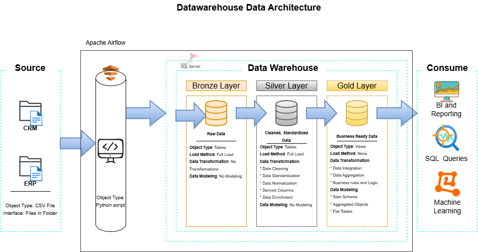

# 📊Data_warehouse_project
Building a Data warehouse with a SQL server, including ETL process, Data Cleaning, Data Modeling, Data Integration, and  analytics.
## 🚀 Project Overview
This project contains a SQL Server–based Data Warehouse project that demonstrates core data engineering concepts, including raw data ingestion, ETL processing, data transformation, and dimensional modeling. The project focuses on structuring data into layered storage and analytics-ready tables using SQL.

This project was developed by following the “SQL Course” tutorial by DataWithBaraa, which provides practical guidance on implementing layered data architecture and SQL-based data pipelines.
## 🛠️ Tools & Technologies Used
- **SQL Server** – Used as the primary data warehouse platform.
- **SQL** – Used for data ingestion, transformation, and analytical queries.
- **SQL Server Management Studio (SSMS)** – Used for database development and query execution.
- **Flat Files (CSV)** – Used as source data for ingestion.
## 🧠 Skills Gained
- SQL development and optimization
- ETL pipeline implementation
- Dimensional data modeling
- Data integration and transformation
- Analytics-ready data design
## 🧱 Architecture
The data architecture for this project follows Medallion Architecture Bronze, Silver, and Gold layers:

**Bronze Layer** – Raw data ingestion as received (unchanged staging).

**Silver Layer** – Data cleaning, standardization, and normalization.

**Gold Layer** – Business-ready data organized via dimensional models (star schema). 

## 📂 Project Files
**datasets** – Input data files used for ingestion.

**scripts** – SQL scripts for building tables, cleaning data, and populating warehouse tables.

**tests** – Any validation or query tests for quality checks.

**documents** – Additional documentation or notes supporting your workflow.
## 🔗 Connect with Me

