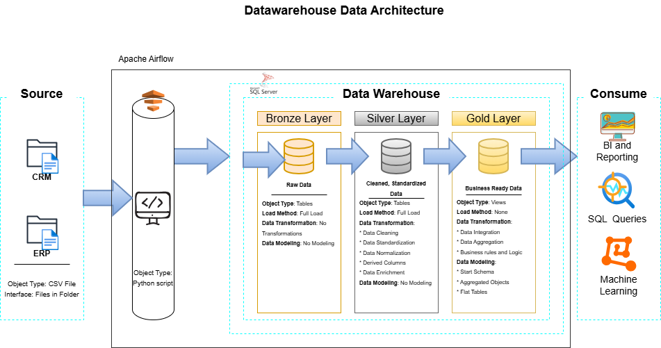

# 📊Data_warehouse_project(SQL Server + Apache Airflow)
This project demonstrates the design and implementation of a modern data warehouse using SQL Server and Apache Airflow. It includes end-to-end ETL processes such as data ingestion, cleaning, transformation, and integration to build analytics-ready datasets for reporting and business insights.
A detailed explanation of the architecture, pipeline, and implementation is provided in the Project Overview section below.

## 🚀 Project Overview
This project reflects a **production-style Data Warehouse using SQL Server**, built on the **Medallion Architecture (Bronze → Silver → Gold)**. It showcases core data engineering concepts, including raw data ingestion, ETL pipeline development, data transformation, and structured data modeling.

The pipeline ingests raw data from flat files, processes it through layered transformations, and produces **analytics-ready datasets optimized for reporting and business insights**. The architecture shows clear separation between raw, cleaned, and business layers to improve data quality, scalability, and usability.

In addition, the project integrates **Apache Airflow for workflow orchestration**, enabling automated pipeline execution with task-level visibility, improved reliability, and scheduling capabilities.

This implementation is inspired by practical learning from the *DataWithBaraa SQL Course*, in which  I have done additional enhancements such as pipeline orchestration and modular task design to reflect real-world data engineering practices.
## 🛠️ Tools & Technologies Used
- **SQL Server** – Used as the primary data warehouse platform.
- **SQL** – Used for data ingestion, transformation, and analytical queries.
- **Python** - Used for pipline execution and orchestration logic
- **SQL Server Management Studio (SSMS)** – Used for database development and query execution.
- **Apache Airflow** – used for orchestration
- **Docker** – Containerized Airflow environment
- **Flat Files (CSV)** – Used as source data for ingestion.
## 🧠 Skills Gained
- SQL development and optimization
- ETL pipeline implementation
- Workflow Orchestration using Airflow
- Docker-based Environment Setup
- Dimensional data modeling
- Data integration and transformation
- Analytics-ready data design
## 🧱 Architecture
The data architecture for this project follows Medallion Architecture Bronze, Silver, and Gold layers:

**Bronze Layer** – Raw data ingestion as received (unchanged staging).

**Silver Layer** – Data cleaning, standardization, and normalization.

**Gold Layer** – Business-ready data organized via dimensional models (star schema). 

## 📂 Project Files
**datasets** – Input data files used for ingestion.

**airflow/dags/** - DAG Python scripts that specifies the tasks

**documents** - Contains the Modeling and Architecture images

**ingestion** - Contains a Python script where I have built a pipeline

**scripts** – SQL scripts for building tables, cleaning data, and populating warehouse tables.

**tests** – Any validation or query tests for quality checks.

**documents** – Additional documentation or notes supporting your workflow.
## 🔗 Connect with Me

